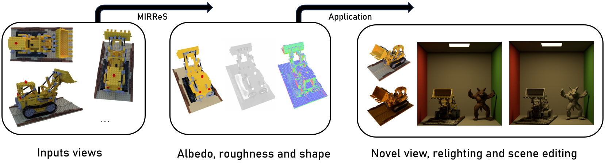

# MIRReS: Multi-bounce Inverse Rendering using Reservoir Sampling


This repository contains a PyTorch implementation of : [MIRReS: Multi-bounce Inverse Rendering using Reservoir Sampling](https://brabbitdousha.github.io/MIRReS/).

### [Project Page](https://brabbitdousha.github.io/MIRReS/) | [Paper(Arxiv)](https://arxiv.org/abs/2406.16360)


# Acknowledgement

* The PyTorch code of ray and mesh querying along with BVH building can be found at [A-Python-Ray-Mesh-Intersector-in-Slangpy](https://github.com/brabbitdousha/A-Python-Ray-Mesh-Intersector-in-Slangpy)
* The ReSTIR code is based on [ReSTIR_PT](https://github.com/DQLin/ReSTIR_PT).
* The path tracing code is based on [pbrt-v3](https://github.com/mmp/pbrt-v3) and [Falcor](https://github.com/NVIDIAGameWorks/Falcor).
* The NeRF framework is based on [nerf2mesh](https://github.com/ashawkey/nerf2mesh).

# Install

```bash
git clone https://github.com/brabbitdousha/ReSTIRpath_nerf_mesh.git
cd ReSTIRpath_nerf_mesh
```

### Install with pip
```bash
get right cuda version of your pytorch first

pip install -r requirements.txt

# tiny-cuda-nn
pip install git+https://github.com/NVlabs/tiny-cuda-nn/#subdirectory=bindings/torch

# nvdiffrast
pip install git+https://github.com/NVlabs/nvdiffrast/

# pytorch3d
pip install git+https://github.com/facebookresearch/pytorch3d.git
```

### Build extension (optional)
This step is copied from nerf2mesh

By default, we use [`load`](https://pytorch.org/docs/stable/cpp_extension.html#torch.utils.cpp_extension.load) to build the extension at runtime.
However, this may be inconvenient sometimes.
Therefore, we also provide the `setup.py` to build each extension:
```bash
# install all extension modules
bash scripts/install_ext.sh

# if you want to install manually, here is an example:
cd raymarching
python setup.py build_ext --inplace # build ext only, do not install (only can be used in the parent directory)
pip install . # install to python path (you still need the raymarching/ folder, since this only install the built extension.)
```

### Tested environments
* Linux with torch 2.2.0 and CUDA 12.1 on a RTX4090.

# Check points and results
If you don't want to take the whole process of training, our checkpoints and results can be found at [dataset and checkpoints and result](https://zenodo.org/records/12094184)

# Usage

We support the original NeRF data format, so we convert the [TensoIR-Synthetic](https://zenodo.org/records/7880113#.ZE68FHZBz18) into NeRF data format: [Our format of TensoIR-Synthetic](https://zenodo.org/records/12094184). and of course we support the original [nerf-synthetic](https://drive.google.com/drive/folders/128yBriW1IG_3NJ5Rp7APSTZsJqdJdfc1).

First time running will take some time to compile the CUDA extensions.
If something went wrong with slangpy or other cpp extensions, switch to the debug mode, after everything runs successfully, you can switch back.

### Basics
Take the TensoIR lego as an example

The first stage:
```bash
#stage0:
python main.py data/tensoir_syn/tensoir_train/tensoir_lego --workspace ir_lego/ -O --bound 1 --scale 0.8 --dt_gamma 0 --stage 0 --lambda_tv 1e-8 --iters 50000
```

In our paper settings, we use [NeuS2](https://github.com/19reborn/NeuS2) as the mesh input and refine it in the next stage, however sometimes [NeuS](https://github.com/Totoro97/NeuS) can produce better mesh, but this is your option, you can put your own mesh from other methods.

Our mesh can be found in the [mesh_stage0.rar](https://zenodo.org/records/12094184)
```bash
change the {workspace}/mesh_stage0/mesh_0.ply, to your mesh, and rename it: mesh_0.ply
Our provided mesh can be used directly, but please make sure your mesh and the mesh_0.ply are in the same coordinate system, you can check them in Blender, Maya or such.
```

The second stage:
```bash
#stage1:
python main.py data/tensoir_syn/tensoir_train/tensoir_lego --workspace ir_lego/ -O --bound 1 --scale 0.8 --dt_gamma 0 --stage 1 --use_brdf --use_restir --lambda_kd 0.017 --lambda_ks 0.0001 --lambda_normal 0.0001 --lambda_edgelen 0.1 --lambda_nrm 0.00035 --lambda_rgb_brdf 0.05 --lambda_brdf_diffuse 0.002 --lambda_brdf_specular 0.00003
```

***evaluate the Novel View Synthesis using 512 spp***, The spp used during training was too small, so you need to obtain the results after convergence for evaluation.
```bash
python main.py data/tensoir_syn/tensoir_train/tensoir_lego --workspace ir_lego/ -O --bound 1 --scale 0.8 --dt_gamma 0 --stage 1 --use_brdf --use_restir --test --test_no_mesh --spp 512
```

Albedo evaluation

this step requires the original [TensoIR-Synthetic](https://zenodo.org/records/7880113#.ZE68FHZBz18), so please download it first.

```bash
#Albedo eval
please check albedo_eval.py
you will get the albedo scale factor after running it
```

Relighting
```bash
# relighting eval
# for example bridge
# change the envmap and albedo scale for each scene
python main.py data/tensoir_syn/tensoir_relight/lego/test_bridge --workspace ir_lego/ -O --bound 1 --scale 0.8 --dt_gamma 0 --stage 1 --use_brdf --use_restir --test --test_no_mesh --spp 128 --albedo_scale_x X.XX --albedo_scale_y X.XX --albedo_scale_z X.XX --envmap_path data/tensoir_syn/tensoir_relight/envmap/bridge.hdr
```
and of course you can put the exported mesh and textures into rendering engine or such, ```feat0_0.jpg``` stands for Albedo, and in ```feat1_0.jpg``` , R is zero, G is roughness and B is metallic. 

### Other Datasets

**All the steps of running other datasets are in the [./configs](./configs/)**

### Custom Dataset

**Please check [general_config_for_your_dataset](./configs/general_config_for_your_dataset.txt)**

### Other usage about the framework

the framework is based on [nerf2mesh](https://github.com/ashawkey/nerf2mesh), please check their instruction for more details on NeRF training. 

Besides, we changed their network to the original ngp network: [torch-ngp](https://github.com/ashawkey/torch-ngp) because this can get better results in our settings.

# Citation(arXiv)

```
@misc{dai2024mirres,
      title={MIRReS: Multi-bounce Inverse Rendering using Reservoir Sampling}, 
      author={Yuxin Dai and Qi Wang and Jingsen Zhu and Dianbing Xi and Yuchi Huo and Chen Qian and Ying He},
      year={2024},
      eprint={2406.16360},
      archivePrefix={arXiv},
      primaryClass={id='cs.CV' full_name='Computer Vision and Pattern Recognition' is_active=True alt_name=None in_archive='cs' is_general=False description='Covers image processing, computer vision, pattern recognition, and scene understanding. Roughly includes material in ACM Subject Classes I.2.10, I.4, and I.5.'}
}
```
